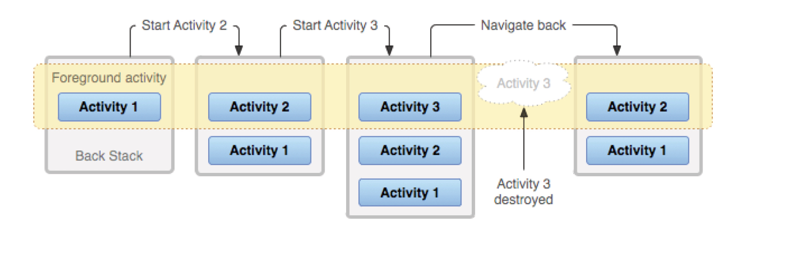
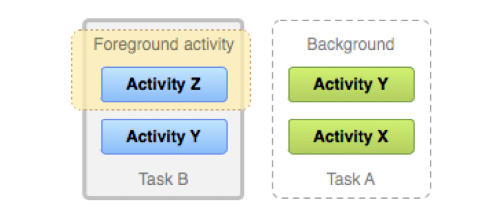
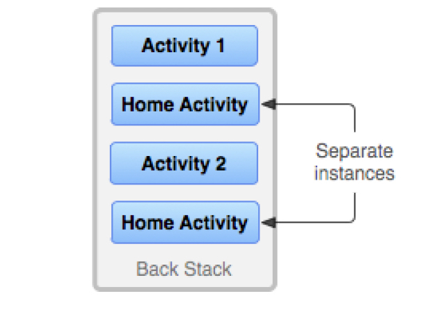
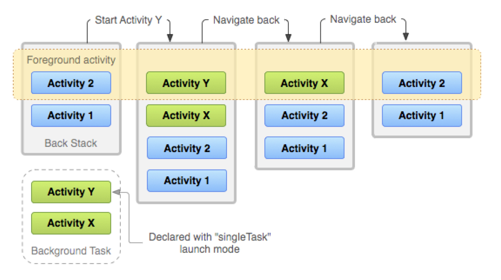

##  任务和返回堆栈
任务是⽤⼾在执⾏某项⼯作时与之互动的⼀系列 Activity 的集合。这些 Activity 按照每个 Activity 打开的顺序排列在⼀个返回堆栈中。

⼤多数任务都从设备主屏幕上启动。当⽤⼾启动应用时，该应⽤的任务就会转到前台运⾏。如果该应⽤没有任务存在（应⽤最近没有使⽤过），则会创建⼀个新的任务，并且该应⽤的“主”Activity 将会作为堆栈的根 Activity 打开。

在当前 Activity 启动另⼀个 Activity 时，新的 Activity 将被推送到堆栈顶部并获得焦点。上⼀个 Activity 仍保留在堆栈中，但会停⽌。当 Activity 停⽌时，系统会保留其界⾯的当前状态。当⽤⼾按返回按钮时，当前 Activity 会从堆栈顶部退出（**该 Activity 销毁 --- 如果想再次回到这个Activity, 系统会新创建该Activity**），上⼀个 Activity 会恢复（界⾯会恢复到上⼀个状态）。堆栈中的 Activity 永远不会重新排列，只会被送⼊和退出，在当前 Activity 启动时被送⼊堆栈，在⽤⼾使⽤返回按钮离开时从堆栈中退出。因此，返回堆栈按照“后进先出”的对象结构运作。


如果⽤⼾继续按**返回**，则堆栈中的 Activity 会逐个退出，以显⽰前⼀个 Activity，直到⽤⼾返回到主屏幕（或任务开始时运⾏的 Activity）。移除堆栈中的所有 Activity 后，该任务将不复存在。

**任务是⼀个整体单元，⼀个任务对应⼀个堆栈。**当⽤⼾开始⼀个新任务或通过主屏幕按钮进⼊主屏幕时，任务可移⾄“后台”。在后台时，任务中的所有 Activity 都会停⽌，但任务的返回堆栈会保持不变，当其他任务启动时，当前任务只是失去了焦点。

举例来说，假设当前任务（任务 A）的堆栈中有 3 个 Activity，当前 Activity 下有 2 个 Activity。⽤⼾按主屏幕按钮，然后从应⽤启动器中启动新应⽤。主屏幕出现后，任务 A 转到后台。当新应⽤启动时，系统会启动该应⽤的任务（任务 B），该任务具有⾃⼰的 Activity 堆栈。与该应⽤互动后，⽤⼾再次返回到主屏幕并选择最初启动任务 A 的应⽤。现在，任务 A 进⼊前台，其堆栈中的所有三个 Activity 都完好如初，堆栈顶部的 Activity 恢复运⾏。

**注意：**多个任务可以同时在后台进⾏。但是，如果⽤⼾同时运⾏很多后台任务，系统可能会为了恢复内存⽽开始销毁后台 Activity，导致 Activity 状态丢失。

由于返回堆栈中的 Activity 不会被重新排列，如果应⽤允许⽤⼾从多个 Activity 启动特定的 Activity，系统便会创建该 Activity 的新实例并将其推送到堆栈中（⽽不是将该 Activity 的某个先前的实例移⾄堆栈顶部）。这样⼀来，**应⽤中的⼀个 Activity 就可能被多次实例化。**
<center><p></center></p>

如图所⽰。如果⽤⼾使⽤返回按钮向后导航，Activity 的每个实例将按照它们被打开的顺序显⽰出来（每个实例都有⾃⼰的界⾯状态）。不过，如果不希望某个 Activity 被实例化多次，可以修改此⾏为。

Activity 和任务的默认⾏为总结如下：
* 当 Activity A 启动 Activity B 时，Activity A 会停⽌，但系统会保留其状态（例如滚动位置和输⼊到表单中的⽂本）。如果⽤⼾在 Activity B 中按 **返回** 按钮，系统会恢复 Activity A 及其状态。
* 当⽤⼾通过按主屏幕按钮离开任务时，当前 Activity 会停⽌，其任务会转到后台。系统会保留任务中每个 Activity 的状态。如果⽤⼾稍后通过点按该任务的启动器图标来恢复该任务，该任务会进⼊前台并恢复堆栈顶部的 Activity。
* 如果⽤⼾按 **返回** 按钮，当前 Activity 将从堆栈中退出并销毁。堆栈中的上⼀个 Activity 将恢复。
* Activity 被销毁后，系统不会保留该 Activity 的状态。Activity 可以多次实例化，甚⾄是从其他任务对其进⾏实例化。

## 定义启动模式
可以通过启动模式定义 Activity 的新实例如何与当前任务关联。可以通过两种⽅式定义不同的启动模式：
* **使⽤清单⽂件：** 当在清单⽂件中声明 Activity 时，可以指定该 Activity 在启动时如何与任务关联。
* **使⽤ Intent 标记：** 当调⽤ startActivity() 时，可以在 Intent 中添加⼀个标记，⽤于声明新 Activity 如何（或是否）与当前任务相关联。

因此，如果 Activity A 启动 Activity B，Activity B 可在其清单中定义如何与当前任务相关联（如果关联的话），Activity A 也可以请求 Activity B 应该如何与当前任务关联。如果两个 Activity 都定义了 Activity B 应如何与任务关联，将优先遵循 Activity A 的请求（在 intent 中定义），⽽不是 Activity B 的请求（在清单中定义）。
**注意：** 有些启动模式可通过清单⽂件定义，但不能通过 intent 标记定义，同样，有些启动模式可通过 intent 标记定义，却不能在清单中定义。

### 使⽤清单⽂件
在清单⽂件中声明 Activity 时，可以使⽤ <activity> 元素的 launchMode 属性指定 Activity 应该如何与任务关联。
launchMode 属性说明了 Activity 应如何启动到任务中。
**可以为 launchMode 属性指定 4 种不同的启动模式：**

#### "standard" （默认模式）
系统在启动该 Activity 的任务中创建 Activity 的新实例，并将 intent 传送给该实例。Activity 可以多次实例化，每个实例可以属于不同的任务，⼀个任务可以拥有多个实例。
先启动MainActivity，再启动SecondActivity，再启动ThirdActivity，最后启动另一个MainActivity，均为standard模式，启动的所有Activity均在同一个task下，且启动的两个MainActivity是两个不同的实例
```
2020-07-17 14:21:29.587 3610-3610/com.example.learnandroid D/MainActivity: com.example.learnandroid.MainActivity@1cc4201 task id: 177 onCreate
2020-07-17 14:21:29.661 3610-3610/com.example.learnandroid D/MainActivity: com.example.learnandroid.MainActivity@1cc4201 task id: 177 onStart
2020-07-17 14:21:29.662 3610-3610/com.example.learnandroid D/MainActivity: com.example.learnandroid.MainActivity@1cc4201 task id: 177 onResume
2020-07-17 14:21:33.863 3610-3610/com.example.learnandroid D/MainActivity: com.example.learnandroid.MainActivity@1cc4201 task id: 177 onPause
2020-07-17 14:21:33.872 3610-3610/com.example.learnandroid D/SecondActivity: com.example.learnandroid.SecondActivity@a41f0d4 task id: 177 onCreate
2020-07-17 14:21:33.910 3610-3610/com.example.learnandroid D/SecondActivity: com.example.learnandroid.SecondActivity@a41f0d4 task id: 177 onStart
2020-07-17 14:21:33.911 3610-3610/com.example.learnandroid D/SecondActivity: com.example.learnandroid.SecondActivity@a41f0d4 task id: 177 onResume
2020-07-17 14:21:34.342 3610-3610/com.example.learnandroid D/MainActivity: com.example.learnandroid.MainActivity@1cc4201 task id: 177 onStop
2020-07-17 14:21:34.343 3610-3610/com.example.learnandroid D/MainActivity: com.example.learnandroid.MainActivity@1cc4201 task id: 177 onSaveInstanceState
2020-07-17 14:21:35.942 3610-3610/com.example.learnandroid D/SecondActivity: com.example.learnandroid.SecondActivity@a41f0d4 task id: 177 onPause
2020-07-17 14:21:35.950 3610-3610/com.example.learnandroid D/ThirdActivity: com.example.learnandroid.ThirdActivity@3a4c2ea task id: 177 onCreate
2020-07-17 14:21:35.990 3610-3610/com.example.learnandroid D/ThirdActivity: com.example.learnandroid.ThirdActivity@3a4c2ea task id: 177 onStart
2020-07-17 14:21:35.991 3610-3610/com.example.learnandroid D/ThirdActivity: com.example.learnandroid.ThirdActivity@3a4c2ea task id: 177 onResume
2020-07-17 14:21:36.433 3610-3610/com.example.learnandroid D/SecondActivity: com.example.learnandroid.SecondActivity@a41f0d4 task id: 177 onStop
2020-07-17 14:22:06.276 3610-3610/com.example.learnandroid D/ThirdActivity: com.example.learnandroid.ThirdActivity@3a4c2ea task id: 177 onPause
2020-07-17 14:22:06.321 3610-3610/com.example.learnandroid D/ThirdActivity: com.example.learnandroid.ThirdActivity@3a4c2ea task id: 177 onStop
2020-07-17 14:23:20.587 3610-3610/com.example.learnandroid D/MainActivity: com.example.learnandroid.MainActivity@4619f6b task id: 177 onCreate
2020-07-17 14:23:20.631 3610-3610/com.example.learnandroid D/MainActivity: com.example.learnandroid.MainActivity@4619f6b task id: 177 onStart
2020-07-17 14:23:20.632 3610-3610/com.example.learnandroid D/MainActivity: com.example.learnandroid.MainActivity@4619f6b task id: 177 onResume
2020-07-17 14:23:21.084 3610-3610/com.example.learnandroid D/ThirdActivity: com.example.learnandroid.ThirdActivity@3a4c2ea task id: 177 onStop
```

#### "singleTop"
如果当前任务的顶部已存在 Activity 的实例，则系统会通过调⽤其 onNewIntent() ⽅法来将 intent 转送给该实例，⽽不是创建 Activity 的新实例。Activity 可以多次实例化，每个实例可以属于不同的任务，⼀个任务可以拥有多个实例（但前提是返回堆栈顶部的 Activity 不是该Activity 的现有实例）。
- 解决的问题：重复创建栈顶Activity
- 先启动一个standard模式的MainActivity，再启动一个singleTop模式的MainActivity：

```
2020-07-17 14:29:11.473 4433-4433/com.example.learnandroid D/MainActivity: com.example.learnandroid.MainActivity@1cc4201 task id: 179 onCreate
2020-07-17 14:29:11.546 4433-4433/com.example.learnandroid D/MainActivity: com.example.learnandroid.MainActivity@1cc4201 task id: 179 onStart
2020-07-17 14:29:11.547 4433-4433/com.example.learnandroid D/MainActivity: com.example.learnandroid.MainActivity@1cc4201 task id: 179 onResume
2020-07-17 14:29:21.683 4433-4433/com.example.learnandroid D/MainActivity: com.example.learnandroid.MainActivity@1cc4201 task id: 179 onPause
2020-07-17 14:29:21.684 4433-4433/com.example.learnandroid D/MainActivity: com.example.learnandroid.MainActivity@1cc4201 task id: 179 onNewIntent
2020-07-17 14:29:21.684 4433-4433/com.example.learnandroid D/MainActivity: com.example.learnandroid.MainActivity@1cc4201 task id: 179 onResume
```
- 接上，如果再启动standard模式的MainActivity，会创建新实例：

```
2020-07-17 14:29:51.406 4433-4433/com.example.learnandroid D/MainActivity: com.example.learnandroid.MainActivity@1cc4201 task id: 179 onPause
2020-07-17 14:29:51.416 4433-4433/com.example.learnandroid D/MainActivity: com.example.learnandroid.MainActivity@cdc8ce task id: 179 onCreate
2020-07-17 14:29:51.463 4433-4433/com.example.learnandroid D/MainActivity: com.example.learnandroid.MainActivity@cdc8ce task id: 179 onStart
2020-07-17 14:29:51.464 4433-4433/com.example.learnandroid D/MainActivity: com.example.learnandroid.MainActivity@cdc8ce task id: 179 onResume
2020-07-17 14:29:51.890 4433-4433/com.example.learnandroid D/MainActivity: com.example.learnandroid.MainActivity@1cc4201 task id: 179 onStop
2020-07-17 14:29:51.891 4433-4433/com.example.learnandroid D/MainActivity: com.example.learnandroid.MainActivity@1cc4201 task id: 179 onSaveInstanceState
```
- 先启动一个MainActivity，再启动一个SecondActivity，此时MainActivity不在栈顶，再以singleTop模式启动一个MainActivity，还是会创建新实例：

```
2020-07-17 14:33:42.543 4872-4872/com.example.learnandroid D/MainActivity: com.example.learnandroid.MainActivity@1cc4201 task id: 180 onCreate
2020-07-17 14:33:42.614 4872-4872/com.example.learnandroid D/MainActivity: com.example.learnandroid.MainActivity@1cc4201 task id: 180 onStart
2020-07-17 14:33:42.615 4872-4872/com.example.learnandroid D/MainActivity: com.example.learnandroid.MainActivity@1cc4201 task id: 180 onResume
2020-07-17 14:33:49.791 4872-4872/com.example.learnandroid D/MainActivity: com.example.learnandroid.MainActivity@1cc4201 task id: 180 onPause
20-07-17 14:33:49.802 4872-4872/com.example.learnandroid D/SecondActivity: com.example.learnandroid.SecondActivity@c031dc3 task id: 180 onCreate
2020-07-17 14:33:49.838 4872-4872/com.example.learnandroid D/SecondActivity: com.example.learnandroid.SecondActivity@c031dc3 task id: 180 onStart
2020-07-17 14:33:49.839 4872-4872/com.example.learnandroid D/SecondActivity: com.example.learnandroid.SecondActivity@c031dc3 task id: 180 onResume
2020-07-17 14:33:50.274 4872-4872/com.example.learnandroid D/MainActivity: com.example.learnandroid.MainActivity@1cc4201 task id: 180 onStop
2020-07-17 14:33:50.276 4872-4872/com.example.learnandroid D/MainActivity: com.example.learnandroid.MainActivity@1cc4201 task id: 180 onSaveInstanceState
2020-07-17 14:33:57.969 4872-4872/com.example.learnandroid D/SecondActivity: com.example.learnandroid.SecondActivity@c031dc3 task id: 180 onPause
7-17 14:33:57.993 4872-4872/com.example.learnandroid D/MainActivity: com.example.learnandroid.MainActivity@61050ee task id: 180 onCreate
2020-07-17 14:33:58.038 4872-4872/com.example.learnandroid D/MainActivity: com.example.learnandroid.MainActivity@61050ee task id: 180 onStart
2020-07-17 14:33:58.039 4872-4872/com.example.learnandroid D/MainActivity: com.example.learnandroid.MainActivity@61050ee task id: 180 onResume
2020-07-17 14:33:58.465 4872-4872/com.example.learnandroid D/SecondActivity: com.example.learnandroid.SecondActivity@c031dc3 task id: 180 onStop
```
#### "singleTask" 
系统会创建新任务，并实例化新任务的根 Activity。但是，如果另外的任务中已存在该 Activity 的实例，则系统会通过调⽤其 onNewIntent() ⽅法将 intent 转送到该现有实例，⽽不是创建新实例。**重⽤时，会让该实例回到栈顶，因此在它上⾯的实例将会被移出栈。** 如果栈中不存在该实例，将会创建新的实例放⼊栈中。Activity ⼀次只能有⼀个实例存在。
**注意：** 虽然 Activity 在新任务中启动，但⽤⼾按返回按钮仍会返回到上⼀个 Activity。

- singleTop解决重复创建栈顶Activity，如果Activity没有在栈顶，还是会重复创建
  - singleTask让某个任务中只有一个Activity实例
- 如果任务栈中没有当前Activity的实例
  - 一般情况下，在栈中创建新实例
  - 如果指定了不同的taskAffinity，会开新栈来创建新实例

在清单文件中给ThirdActivity注册singleTask模式，行为表现：
```
ThirdActivity配置为singleTask模式，先启动MainActivity，再启动一个ThirdActivity，再启动一个SecondActivity，最后再启动一个ThirdActivity
2020-07-17 15:22:22.226 6720-6720/com.example.learnandroid D/MainActivity: com.example.learnandroid.MainActivity@1cc4201 task id: 187 onCreate
2020-07-17 15:22:22.331 6720-6720/com.example.learnandroid D/MainActivity: com.example.learnandroid.MainActivity@1cc4201 task id: 187 onStart
2020-07-17 15:22:22.332 6720-6720/com.example.learnandroid D/MainActivity: com.example.learnandroid.MainActivity@1cc4201 task id: 187 onResume
MainActivity启动完成
2020-07-17 15:22:27.413 6720-6720/com.example.learnandroid D/MainActivity: com.example.learnandroid.MainActivity@1cc4201 task id: 187 onPause
2020-07-17 15:22:27.423 6720-6720/com.example.learnandroid D/ThirdActivity: com.example.learnandroid.ThirdActivity@a41f0d4 task id: 187 onCreate
2020-07-17 15:22:27.460 6720-6720/com.example.learnandroid D/ThirdActivity: com.example.learnandroid.ThirdActivity@a41f0d4 task id: 187 onStart
2020-07-17 15:22:27.461 6720-6720/com.example.learnandroid D/ThirdActivity: com.example.learnandroid.ThirdActivity@a41f0d4 task id: 187 onResume
2020-07-17 15:22:27.916 6720-6720/com.example.learnandroid D/MainActivity: com.example.learnandroid.MainActivity@1cc4201 task id: 187 onStop
2020-07-17 15:22:27.918 6720-6720/com.example.learnandroid D/MainActivity: com.example.learnandroid.MainActivity@1cc4201 task id: 187 onSaveInstanceState
第一个ThirdActivity启动完成，MainActivity被stop
2020-07-17 15:22:30.355 6720-6720/com.example.learnandroid D/ThirdActivity: com.example.learnandroid.ThirdActivity@a41f0d4 task id: 187 onPause
2020-07-17 15:22:30.363 6720-6720/com.example.learnandroid D/SecondActivity: com.example.learnandroid.SecondActivity@7df90bf task id: 187 onCreate
2020-07-17 15:22:30.398 6720-6720/com.example.learnandroid D/SecondActivity: com.example.learnandroid.SecondActivity@7df90bf task id: 187 onStart
2020-07-17 15:22:30.399 6720-6720/com.example.learnandroid D/SecondActivity: com.example.learnandroid.SecondActivity@7df90bf task id: 187 onResume
2020-07-17 15:22:30.830 6720-6720/com.example.learnandroid D/ThirdActivity: com.example.learnandroid.ThirdActivity@a41f0d4 task id: 187 onStop
SecondActivity启动完成，ThirdActivity被stop
2020-07-17 15:22:32.213 6720-6720/com.example.learnandroid D/SecondActivity: com.example.learnandroid.SecondActivity@7df90bf task id: 187 onPause
2020-07-17 15:22:32.225 6720-6720/com.example.learnandroid D/ThirdActivity: com.example.learnandroid.ThirdActivity@a41f0d4 task id: 187 onNewIntent
2020-07-17 15:22:32.225 6720-6720/com.example.learnandroid D/ThirdActivity: com.example.learnandroid.ThirdActivity@a41f0d4 task id: 187 onRestart
2020-07-17 15:22:32.225 6720-6720/com.example.learnandroid D/ThirdActivity: com.example.learnandroid.ThirdActivity@a41f0d4 task id: 187 onStart
2020-07-17 15:22:32.226 6720-6720/com.example.learnandroid D/ThirdActivity: com.example.learnandroid.ThirdActivity@a41f0d4 task id: 187 onResume
2020-07-17 15:22:32.642 6720-6720/com.example.learnandroid D/SecondActivity: com.example.learnandroid.SecondActivity@7df90bf task id: 187 onStop
2020-07-17 15:22:32.644 6720-6720/com.example.learnandroid D/SecondActivity: com.example.learnandroid.SecondActivity@7df90bf task id: 187 onDestroy
在ThirdActivity之上的SecondActivity被销毁，ThirdActivity调用onNewIntent后重启
```
- 使用Intent中FLAG_ACTIVITY_NEW_TASK和FLAG_ACTIVITY_CLEAR_TOP两个flag的组合并不能完全实现singleTask：

```
先以standard模式启动一个MainActivity，再以standard模式启动一个ThirdActivity，最后以NEW_TASK和CLEAR_TOP两个flag启动MainActivity
2020-07-21 10:28:13.565 17775-17775/com.example.learnandroid D/MainActivity: com.example.learnandroid.MainActivity@352c86d task id: 345 onCreate
2020-07-21 10:28:13.644 17775-17775/com.example.learnandroid D/MainActivity: com.example.learnandroid.MainActivity@352c86d task id: 345 onStart
2020-07-21 10:28:13.645 17775-17775/com.example.learnandroid D/MainActivity: com.example.learnandroid.MainActivity@352c86d task id: 345 onResume
2020-07-21 10:29:07.929 17775-17775/com.example.learnandroid D/MainActivity: com.example.learnandroid.MainActivity@352c86d task id: 345 onPause
20-07-21 10:29:07.938 17775-17775/com.example.learnandroid D/ThirdActivity: com.example.learnandroid.ThirdActivity@594599f task id: 345 onCreate
2020-07-21 10:29:07.974 17775-17775/com.example.learnandroid D/ThirdActivity: com.example.learnandroid.ThirdActivity@594599f task id: 345 onStart
2020-07-21 10:29:07.975 17775-17775/com.example.learnandroid D/ThirdActivity: com.example.learnandroid.ThirdActivity@594599f task id: 345 onResume
2020-07-21 10:29:08.402 17775-17775/com.example.learnandroid D/MainActivity: com.example.learnandroid.MainActivity@352c86d task id: 345 onStop
2020-07-21 10:29:08.403 17775-17775/com.example.learnandroid D/MainActivity: com.example.learnandroid.MainActivity@352c86d task id: 345 onSaveInstanceState
以NEW_TASK和CLEAR_TOP两个flag启动MainActivity，ThirdActivity和原有的MainActivity被销毁，新建了一个MainActivity的实例
2020-07-21 10:29:24.592 17775-17775/com.example.learnandroid D/ThirdActivity: com.example.learnandroid.ThirdActivity@594599f task id: 345 onPause
2020-07-21 10:29:24.597 17775-17775/com.example.learnandroid D/MainActivity: com.example.learnandroid.MainActivity@352c86d task id: 345 onDestroy
2020-07-21 10:29:24.622 17775-17775/com.example.learnandroid D/MainActivity: com.example.learnandroid.MainActivity@c2de2b task id: 345 onCreate
2020-07-21 10:29:24.671 17775-17775/com.example.learnandroid D/MainActivity: com.example.learnandroid.MainActivity@c2de2b task id: 345 onStart
2020-07-21 10:29:24.672 17775-17775/com.example.learnandroid D/MainActivity: com.example.learnandroid.MainActivity@c2de2b task id: 345 onResume
2020-07-21 10:29:25.110 17775-17775/com.example.learnandroid D/ThirdActivity: com.example.learnandroid.ThirdActivity@594599f task id: 345 onStop
2020-07-21 10:29:25.112 17775-17775/com.example.learnandroid D/ThirdActivity: com.example.learnandroid.ThirdActivity@594599f task id: 345 onDestroy
```

⽆论 Activity 是在新任务中启动的，还是在和启动它的 Activity 相同的任务中启动，⽤⼾按返回按钮都会回到上⼀个 Activity。但是，如果启动了指定 singleTask 启动模式的 Activity，⽽后台任务中已存在该 Activity 的实例，则系统会将该后台任务整个转到前台运⾏。此时，返回堆栈包含了转到前台的任务中的所有 Activity，这些 Activity 都位于堆栈的顶部。

采⽤“singleTask”启动模式的 Activity 添加到返回堆栈的过程图⽰。如果 Activity 已经存在于某个具有⾃⼰的返回堆栈的后台任务中，那么整个返回堆栈也会转到前台，覆盖当前任务。


#### "singleInstance" ：
在⼀个新栈中创建该Activity的实例（相当于跳到了1个只有1个Acticity的新stack），并让多个应⽤共享该栈中的该Activity实例。⼀旦该模式的Activity实例已经存在于某个栈中，任何应⽤再激活该Activity时都会重⽤该栈中的实例( 会调⽤实例的 onNewIntent() )。其效果相当于多个应⽤共享⼀个应⽤，不管谁激活该 Activity 都会进⼊同⼀个应⽤中。该 Activity 始终是其任务唯⼀的成员；由该 Activity 启动的任何 Activity 都会在其他的任务中打开。
```
SecondActivity设置为singleInstance，先启动一个MainActivity，再启动一个SecondActivity，再启动一个ThirdActivity，然后从顶层依次返回
2020-07-17 15:46:48.318 7548-7548/com.example.learnandroid D/MainActivity: com.example.learnandroid.MainActivity@1cc4201 task id: 189 onCreate
2020-07-17 15:46:48.418 7548-7548/com.example.learnandroid D/MainActivity: com.example.learnandroid.MainActivity@1cc4201 task id: 189 onStart
2020-07-17 15:46:48.419 7548-7548/com.example.learnandroid D/MainActivity: com.example.learnandroid.MainActivity@1cc4201 task id: 189 onResume
MainActivity启动完成
2020-07-17 15:47:09.862 7548-7548/com.example.learnandroid D/MainActivity: com.example.learnandroid.MainActivity@1cc4201 task id: 189 onPause
2020-07-17 15:47:09.889 7548-7548/com.example.learnandroid D/SecondActivity: com.example.learnandroid.SecondActivity@c031dc3 task id: 190 onCreate
2020-07-17 15:47:09.935 7548-7548/com.example.learnandroid D/SecondActivity: com.example.learnandroid.SecondActivity@c031dc3 task id: 190 onStart
2020-07-17 15:47:09.936 7548-7548/com.example.learnandroid D/SecondActivity: com.example.learnandroid.SecondActivity@c031dc3 task id: 190 onResume
2020-07-17 15:47:10.504 7548-7548/com.example.learnandroid D/MainActivity: com.example.learnandroid.MainActivity@1cc4201 task id: 189 onStop
2020-07-17 15:47:10.506 7548-7548/com.example.learnandroid D/MainActivity: com.example.learnandroid.MainActivity@1cc4201 task id: 189 onSaveInstanceState
SecondActivity启动完成，属于不同的task，此时跳转动画也有变化，不是向右滑动，而是从底部弹出
2020-07-17 15:47:36.407 7548-7548/com.example.learnandroid D/SecondActivity: com.example.learnandroid.SecondActivity@c031dc3 task id: 190 onPause
2020-07-17 15:47:36.429 7548-7548/com.example.learnandroid D/ThirdActivity: com.example.learnandroid.ThirdActivity@3a4c2ea task id: 189 onCreate
2020-07-17 15:47:36.466 7548-7548/com.example.learnandroid D/ThirdActivity: com.example.learnandroid.ThirdActivity@3a4c2ea task id: 189 onStart
2020-07-17 15:47:36.466 7548-7548/com.example.learnandroid D/ThirdActivity: com.example.learnandroid.ThirdActivity@3a4c2ea task id: 189 onResume
2020-07-17 15:47:37.022 7548-7548/com.example.learnandroid D/SecondActivity: com.example.learnandroid.SecondActivity@c031dc3 task id: 190 onStop
ThirdActivity继续从MainActivity所在的栈中启动，跳转动画也是从底部弹出
2020-07-17 15:48:00.379 7548-7548/com.example.learnandroid D/ThirdActivity: com.example.learnandroid.ThirdActivity@3a4c2ea task id: 189 onPause
2020-07-17 15:48:00.386 7548-7548/com.example.learnandroid D/MainActivity: com.example.learnandroid.MainActivity@1cc4201 task id: 189 onRestart
2020-07-17 15:48:00.387 7548-7548/com.example.learnandroid D/MainActivity: com.example.learnandroid.MainActivity@1cc4201 task id: 189 onStart
2020-07-17 15:48:00.387 7548-7548/com.example.learnandroid D/MainActivity: com.example.learnandroid.MainActivity@1cc4201 task id: 189 onResume
2020-07-17 15:48:00.784 7548-7548/com.example.learnandroid D/ThirdActivity: com.example.learnandroid.ThirdActivity@3a4c2ea task id: 189 onStop
2020-07-17 15:48:00.785 7548-7548/com.example.learnandroid D/ThirdActivity: com.example.learnandroid.ThirdActivity@3a4c2ea task id: 189 onDestroy
在ThirdActivity中按返回键，不返回SecondActivity，而是返回了同栈底部的MainActivity
2020-07-17 15:50:54.665 7548-7548/com.example.learnandroid D/MainActivity: com.example.learnandroid.MainActivity@1cc4201 task id: 189 onPause
2020-07-17 15:50:54.672 7548-7548/com.example.learnandroid D/SecondActivity: com.example.learnandroid.SecondActivity@c031dc3 task id: 190 onRestart
2020-07-17 15:50:54.673 7548-7548/com.example.learnandroid D/SecondActivity: com.example.learnandroid.SecondActivity@c031dc3 task id: 190 onStart
2020-07-17 15:50:54.673 7548-7548/com.example.learnandroid D/SecondActivity: com.example.learnandroid.SecondActivity@c031dc3 task id: 190 onResume
2020-07-17 15:50:55.462 7548-7548/com.example.learnandroid D/MainActivity: com.example.learnandroid.MainActivity@1cc4201 task id: 189 onStop
2020-07-17 15:50:55.466 7548-7548/com.example.learnandroid D/MainActivity: com.example.learnandroid.MainActivity@1cc4201 task id: 189 onDestroy
在MainActivity中按返回键，由于当前栈已空，返回到SecondActivity及其所在栈，跳转动画也是从底部弹出
```

### 使⽤ Intent 标记
启动 Activity 时，可以在传送给 startActivity() 的 intent 中添加相应的标记来修改 Activity 与其任务的默认关联。调⽤Intent的setFlags()或addFlags()可配置Intent的Flag属性。可以使⽤以下标记来修改默认⾏为：

#### FLAG_ACTIVITY_NEW_TASK 
在新任务中启动 Activity。如果启动的 Activity 已经有任务在运⾏，则系统会将该任务转到前台并恢复其最后的状态，⽽ Activity 将在 onNewIntent() 中收到新的intent。
这与 "singleTask" launchMode 值产⽣的⾏为相同。

#### FLAG_ACTIVITY_SINGLE_TOP 
如果要启动的 Activity 是当前 Activity（即位于返回堆栈顶部的 Activity），则现有实例会收到对onNewIntent() 的调⽤，⽽不会创建 Activity 的新实例。
这与"singleTop" launchMode 值产⽣的⾏为相同。

#### FLAG_ACTIVITY_CLEAR_TOP 
如果要启动的 Activity 已经在当前任务中运⾏，则不会启动该 Activity 的新实例，⽽是会销毁位于它之上的所有其他 Activity，并通过 onNewIntent() 将此 intent 传送给它的已恢复实例（现在位于堆栈顶部）。
launchMode 属性没有可产⽣此⾏为的值。

`FLAG_ACTIVITY_CLEAR_TOP` 最常与 `FLAG_ACTIVITY_NEW_TASK` 结合使⽤。将这两个标记结合使⽤，可以查找其他任务中的现有 Activity，并将其置于能够响应 intent 的位置。

### 处理亲和性
**“亲和性”** 表⽰ Activity 倾向于属于哪个任务。默认情况下，同⼀应⽤中的所有 Activity 彼此具有亲和性。因此，在默认情况下，同⼀应⽤中的所有 Activity 都倾向于位于同⼀任务。不过，可以修改 Activity 的默认亲和性。在不同应⽤中定义的 Activity 可以具有相同的亲和性，或者在同⼀应⽤中定义的 Activity 也可以被指定不同的任务亲和性。

可以使⽤ `<activity>` 元素的 `taskAffinity` 属性修改任何给定 Activity 的亲和性。`taskAffinity` 属性采⽤字符串值，该值必须不同于 `<manifest>` 元素中声明的默认软件包名称，因为系统使⽤该名称来标识应⽤的默认任务亲和性。

**亲和性可在两种情况下发挥作⽤：** 
* 当启动 Activity 的 intent 包含 `FLAG_ACTIVITY_NEW_TASK` 标记时。
默认情况下，新 Activity 会启动到调⽤`startActivity()` 的 Activity 的任务中。它会被推送到调⽤⽅ Activity 所在的返回堆栈中。但是，如果传递给 `startActivity()` 的 intent 包含 `FLAG_AC
TIVITY_NEW_TASK` 标记，则系统会寻找其他任务来容纳新 Activity。通常会是⼀个新任务，但也可能不是。如果已存在与新 Activity 具有相同亲和性的现有任务，则会将 Activity 启动到该任务中。如果不存在，则会启动⼀个新任务。
如果此标记导致 Activity 启动⼀个新任务，⽽⽤⼾按下主屏幕按钮离开该任务，则必须为⽤⼾提供某种⽅式来返回到该任务。
* 当 Activity 的 `allowTaskReparenting` 属性设为 "true" 时。在这种情况下，⼀旦和 Activity 有亲和性的任务进⼊前台运⾏，Activity 就可从其启动的任务转移到该任务。

### 清除返回堆栈
如果⽤⼾离开任务较⻓时间，系统会清除任务中除根 Activity 以外的所有 Activity。当⽤⼾再次返回到该任务时，只有根 Activity 会恢复。

可以使⽤⼀些 Activity 属性来修改此⾏为：
#### alwaysRetainTaskState 
如果在任务的根 Activity 中将该属性设为 "true" ，则不会发⽣上述默认⾏为。即使经过很⻓⼀段时间后，任务仍会在其堆栈中保留所有 Activity。
##### clearTaskOnLaunch 
如果在任务的根 Activity 中将该属性设为 "true" ，那么只要⽤⼾离开任务再返回，堆栈就会被清除到只剩根 Activity。也就是说，它与`alwaysRetainTaskState` 正好相反。⽤⼾始终会返回到任务的初始状态，即便只是短暂离开任务也是如此。
#### finishOnTaskLaunch 
该属性与 `clearTaskOnLaunch`类似，但它只会作⽤于单个 Activity ⽽⾮整个任务。它还可导致任何 Activity 消失，包括根 Activity。如果将该属性设为 "true" ，则Activity 仅在当前会话中归属于任务。如果⽤⼾离开任务再返回，则该任务将不再存在。

### 启动任务
可以设置⼀个 Activity 作为任务的⼊⼝点，⽅法是为该 Activity 提供⼀个 intent 过滤器，并将`android.intent.action.MAIN` 作为指定操作，将`android.intent.category.LAUNCHER` 作为指定类别。例如：
```xml
<activity ... >
    <intent-filter ... >
        <action android:name="android.intent.action.MAIN"/>
        <category android:name="android.intent.category.LAUNCHE" />
    </intent-filter>
</activity>
```
这种 intent 过滤器可在应⽤启动器中显⽰ Activity 的图标和标签，让⽤⼾可以启动 Activity 并在启动后随时返回到该 Activity 创建的任务。
第⼆个作⽤⾮常重要：⽤⼾必须能够离开任务，之后再使⽤此 Activity 启动器返回到该任务。

因此，只有当 Activity 具有 `ACTION_MAIN` 和 `CATEGORY_LAUNCHER` 过滤器时，才应使⽤ `singleTask` 和 `singleInstance` 这两种启动模式，它们会将 Activity 标记为始终启动任务。
对于那些不希望⽤⼾能够返回到 Activity 的情况，请将 `<activity>` 元素的 `finishOnTaskLaunch` 设置为`"true"`

## Parcelable 和 Bundle
`Parcelable` 和 `Bundle` 对象可跨进程边界使⽤，例如与 IPC/Binder 事务之间，带有 intent 的 Activity 之间等，还可以⽤来存储跨配置更改的瞬时状态。
**注意：** Parcel 不是通⽤序列化机制，绝不能将任何 Parcel 数据存储在磁盘上或通过⽹络发送。

### 在 Activity 之间发送数据
当应⽤创建 Intent 对象以在`startActivity(android.content.Intent)` 中⽤于启动新的Activity 时，应⽤可使⽤ `putExtra(java.lang.String, java.lang.String)` ⽅法传⼊参数。

以下⽰例代码段演⽰了如何执⾏此操作。
```java
Intent intent = new Intent(this, MyActivity.class);
intent.putExtra("media_id", "a1b2c3");
startActivity(intent);
```
操作系统会将 intent 的基础 Bundle 打包。然后，操作系统会创建新的 Activity，将数据拆包，并将 intent 传递给新的 Activity。
建议使⽤ Bundle 类为 Intent 对象设置操作系统已知的基元。 Bundle 类针对使⽤ parcel 进⾏编组和解组进⾏了⾼度优化。

在某些情况下，可能需要⼀种机制来跨 Activity 发送复合对象或复杂对象。在这种情况下，⾃定义类应实现 Parcelable，并提供相应的`writeToParcel(android.os.Parcel, int)` ⽅法。它还必须提供实现 `Parcelable.Creator` 接⼝的⾮空字段 `CREATOR` ，该接⼝的 `createFromParcel()` ⽅法⽤于将 Parcel 转回为当前对象。

通过 intent 发送数据时，应⼩⼼地将数据⼤⼩限制为⼏ KB。发送过多数据会导致系统抛出 `TransactionTooLargeException` 异常。

### 在进程之间发送数据
在进程之间发送数据与在 Activity 之间发送数据类似。不过，在进程之间发送时，建议不要使⽤⾃定义 Parcelable。如果将⼀个⾃定义 Parcelable 对象从⼀个应⽤发送到另⼀个应⽤，则需要确保发送和接收的应⽤上都存在版本完全相同的⾃定义类。通常情况下，这可能是在两个应⽤中都会使⽤的通⽤库。如果应⽤尝试向系统发送⾃定义 Parblelable，则可能会发⽣错误，因为系统⽆法对其不了解的类进⾏解组。

Binder 事务缓冲区的⼤⼩固定有限，⽬前为 1MB，由进程中正在处理的所有事务共享。由于此限制是进程级别⽽不是 Activity 级别的限制，因此这些事务包括应⽤中的所有 binder 事务，例如`onSaveInstanceState`，`startActivity` 以及与系统的任何互动。超过⼤⼩限制时，将引发`TransactionTooLargeException`。

对于 `savedInstanceState 的具体情况`，应将数据量保持在较⼩的规模，因为只要⽤⼾可以返回到该 Activity，系统进程就需要保留所提供的数据（即使 Activity 的进程已终⽌）。建议将保存的状态保持在 50k 数据以下。

