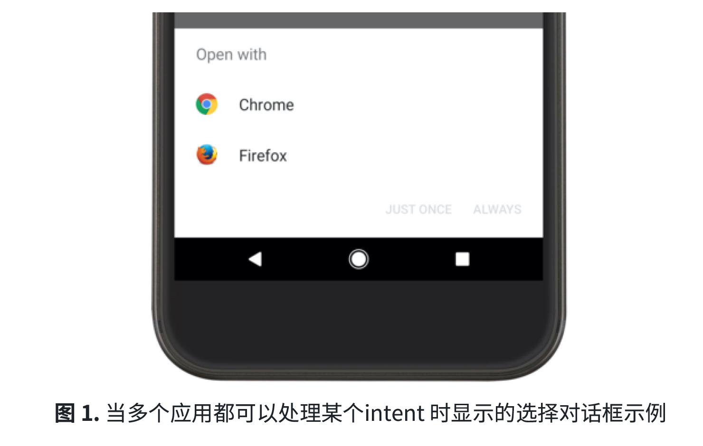

## Activity的交互
### 从另⼀个 Activity 中启动某个 Activity
Activity 通常需要在某个时刻启动另⼀个 Activity。
根据Activity 是否希望从即将启动的新 Activity 中获取返回结果，可以使⽤ startActivity() 或startActivityForResult() ⽅法启动新 Activity。这两种⽅法都需要传⼊⼀个 Intent 对象。
Intent 对象指定要启动的 Activity，或描述要执⾏的操作类型（**系统为选择相应的 Activity，该 Activity 甚⾄可以来⾃不同应⽤**）。Intent 对象还可以携带由已启动的 Activity 使⽤的少量数据。
```java
// 显⽰Intent
Intent intent = new Intent(this, SignInActivity.class);
startActivity(intent);
```
**Intent 的真正作用：** 可以创建⼀个 Intent，对想要执⾏的操作进⾏描述，系统会从其他应⽤启动相应的 Activity。如果有多个 Activity 可以处理 Intent，则⽤⼾可以选择要使⽤哪⼀个。
```java
// 隐式Intent
Intent intent = new Intent(Intent.ACTION_SEND);
intent.putExtra(Intent.EXTRA_EMAIL, recipientArray);
startActivity(intent);
```
添加到 Intent 中的 `EXTRA_EMAIL extra` 是⼀个字符串数组，其中包含电⼦邮件的⽬的发送地址。当电⼦邮件应⽤响应此 Intent 时，该应⽤会读取 extra 中提供的字符串数组。

**startActivityForResult():** 有时会希望在 Activity 结束时从 Activity 中获取返回结果。为此，调⽤`startActivityForResult(Intent, int)` ⽅法，其中整数参数会标识该调⽤。此标识符⽤于消除来⾃同⼀Activity 的多次 `startActivityForResult(Intent, int)`调⽤之间的歧义。这不是全局标识符，不存在与其他应⽤或 Activity 冲突的⻛险。结果通过 `onActivityResult(int, int, Intent)` ⽅法返回。

当⼦级 Activity 退出时，它可以调⽤ `setResult(int)` 将数据返回到其⽗级。⼦级 Activity 必须始终提供结果代码，该结果代码可以是标准结果 `RESULT_CANCELED`、`RESULT_OK`，也可以是从`RESULT_FIRST_USER` 开始的任何⾃定义值。此外，⼦级 Activity 可以随意返回包含其所需的任何其他数据的 Intent 对象。⽗级 Activity 使⽤ `onActivityResult(int, int, Intent)` ⽅法，以及⽗级 Activity 最初提供的整数标识符来接收信息。
如果⼦级 Activity 由于任何原因（例如崩溃）失败，则⽗级 Activity 将收到代码为 `RESULT_CANCELED` 的结果。
```java
public class MyActivity extends Activity {
    static final int PICK_CONTACT_REQUEST = 0;
    public boolean onKeyDown(int keyCode, KeyEvent event) {
        if (keyCode == KeyEvent.KEYCODE_DPAD_CENTER) {
// When the user center presses, let them pick a contact.
            startActivityForResult(new Intent(Intent.ACTION_PICK, new Uri("content://contacts")), PICK_CONTACT_REQUEST);
            return true;
            }
        return false;
        }
    protected void onActivityResult(int requestCode, int resultCode, Intent data) {
        if (requestCode == PICK_CONTACT_REQUEST) {
            if (resultCode == RESULT_OK) {
// A contact was picked. Here we will just display it to the user.
                    startActivity(new Intent(Intent.ACTION_VIEW, data));
            }
        }
    }
}
```

### 协调 Activity
当⼀个 Activity 启动另⼀个 Activity 时，它们都会经历⽣命周期转换。
以下是 Activity A 启动 Activity B 时的操作发⽣顺序：
1. Activity A 的 onPause() ⽅法执⾏。
2. Activity B 的 onCreate()、onStart() 和 onResume() ⽅法依次执⾏。（Activity B 现在具有⽤⼾焦点。）
3. 然后，如果 Activity A 在屏幕上不再可⻅，则其 onStop() ⽅法执⾏。可以利⽤这种可预测的⽣命周期回调顺序管理从⼀个 Activity 到另⼀个 Activity 的信息转换。

## 将⽤⼾转到其他应⽤
使⽤ Intent 甚⾄可以让应⽤启动另⼀个应⽤包含的 Activity。
Intent 可以为显式，以便启动特定组件（特定的 Activity 实例），也可以为隐式，以便启动任何可以处理 Intent 操作（例如“拍摄照⽚”）的组件。
显式 Intent 可定义要启动的组件的确切类名称。但是，如果希望让⼀个单独的应⽤来执⾏某项操作（例如，“查看地图”），则必须使⽤隐式 Intent。

### 编译隐式 Intent
隐式 Intent 不会声明要启动的组件的类名称，⽽是声明要执⾏的操作。操作会指定想要执⾏的操作（例如，查看、修改、发送或获取某项内容）。Intent 中通常还包括与操作相关的数据（例如，要查看的地址或想要发送的电⼦邮件）。

如果数据是 Uri，则可以使⽤简单的 Intent()构造函数来定义操作和数据。

**创建 Intent 来发起通话（使⽤ Uri 数据指定电话号码）：**
```java
Uri number = Uri.parse("tel:5551234");
Intent callIntent = new Intent(Intent.ACTION_DIAL, number);
```
**查看⽹⻚：**
```java
Uri webpage = Uri.parse("http://www.android.com");
Intent webIntent = new Intent(Intent.ACTION_VIEW, webpage);
```
其他类型的隐式 Intent 需要“额外”数据，以提供字符串等不同数据类型。可以使⽤各种不同的 putExtra() ⽅法添加⼀条或多条额外数据。

默认情况下，系统会根据 Intent 中所包含的 Uri 数据来确定 Intent 所需的适当 MIME 类型。**如果不在 Intent 中包括 Uri，通常应使⽤ setType() 来指定与 Intent 相关联的数据类型。** 设置 MIME 类型可以进⼀步指定应接收 Intent 的 Activity 类型。

**发送带有附件的电⼦邮件：**
```java
Intent emailIntent = new Intent(Intent.ACTION_SEND);
// The intent does not have a URI, so declare the "text/plain" MIME type
emailIntent.setType(HTTP.PLAIN_TEXT_TYPE);
emailIntent.putExtra(Intent.EXTRA_EMAIL, new String[] {"jon@example.com"}); //recipients
emailIntent.putExtra(Intent.EXTRA_SUBJECT, "Email subject");
emailIntent.putExtra(Intent.EXTRA_TEXT, "Email message text");
emailIntent.putExtra(Intent.EXTRA_STREAM,
Uri.parse("content://path/to/email/attachment"));
// You can also attach multiple items by passing an ArrayList of Uris
```
注意：尽可能具体地定义 Intent。例如，如果想要使⽤`ACTION_VIEW` Intent 显⽰图⽚，则应将 MIME 类型指定为 `image/*`。这样可以防⽌ Intent 触发可以“查看”其他类型的数据的应⽤（例如，地图应⽤）

### 验证是否存在可接收 Intent 的应⽤
应始终在调⽤ Intent 之前执⾏验证步骤。
**注意：** 如果调⽤了⼀个 Intent，但设备上没有可以处理该 Intent 的应⽤，应⽤将会崩溃。
要验证是否存在可以响应相应 Intent 的 Activity，调⽤ `queryIntentActivities()` 以获取能够处理 Intent 的 Activity 列表。如果返回的 List 不为空，则可以安全地使⽤该 Intent。
```java
PackageManager packageManager = getPackageManager();
List<ResolveInfo> activities = packageManager.queryIntentActivities(intent,PackageManager.MATCH_DEFAULT_ONLY);
boolean isIntentSafe = activities.size() > 0;
```
如果 isIntentSafe 为 true，则⾄少有⼀个应⽤会响应该 Intent。如果为 false，则没有任何应⽤可以处理该 Intent。
**注意：** 应在 Activity 初次启动时执⾏此检查，以防需要在⽤⼾尝试使⽤采⽤相应 Intent 的功能之前将其停⽤。

### 使⽤ Intent 启动 Activity

创建 Intent 并设置额外信息后，调⽤ `startActivity()` 以将其发送到系统。如果系统识别出多个可以处理该 Intent 的 Activity，则会向⽤⼾显⽰⼀个对话框（有时称为“消除歧义对话框”），以供其选择要使⽤的应⽤。

创建 Intent 来查看地图，验证是否存在可以处理该 Intent 的应⽤:
```java
// Build the intent
Uri location = Uri.parse("geo:0,0?q=1600+Amphitheatre+Parkway,+Mountain+View,+California");
Intent mapIntent = new Intent(Intent.ACTION_VIEW, location);
/** Verify it resolves */
PackageManager packageManager = getPackageManager();
List<ResolveInfo> activities = packageManager.queryIntentActivities(mapIntent,0);
boolean isIntentSafe = activities.size() > 0;
// Start an activity if it's safe
if (isIntentSafe) {
    startActivity(mapIntent);
}
```
### 显⽰应⽤选择器

当通过将 Intent 传递给 `startActivity()` 启动⼀个 Activity，并且有多个应⽤可以响应该 Intent 时，⽤⼾可以选择默认使⽤哪个应⽤（⻅图 1）。
但是，如果要执⾏的操作可以由多款应⽤处理并且⽤⼾可能希望每次都使⽤不同的应⽤（例如，“分享”操作，⽤⼾可能有多款应⽤可⽤来分享内容），则应明确显⽰选择器对话框。

选择器对话框会强制⽤⼾选择每次要为相应操作使⽤的应⽤（⽤⼾⽆法针对该操作选择默认应⽤）。要显⽰选择器，使⽤ createChooser() 创建⼀个 Intent，并将其传递给 startActivity()。
```java
Intent intent = new Intent(Intent.ACTION_SEND);
// Always use string resources for UI text.
// This says something like "Share this photo with"
String title = getResources().getString(R.string.chooser_title);
// Create intent to show chooser
Intent chooser = Intent.createChooser(intent, title);
// Verify the intent will resolve to at least one activity
if (intent.resolveActivity(getPackageManager()) != null) {
    startActivity(chooser);
}
```
这会显⽰⼀个对话框，其中包含可响应传递给 `createChooser()` ⽅法的 Intent 的应⽤列表，并将提供的⽂本⽤作对话框标题。

## 获取 Activity 的结果
要接收结果，调⽤ `startActivityForResult()`（⽽⾮ startActivity()）。
当然，响应的 Activity 必须设计为返回结果。当它这样做时，它会作为另⼀个Intent 对象发送结果。Activity 会在 `onActivityResult()` 回调中接收它。

**注意：** 当调⽤ `startActivityForResult()` 时，可以使⽤显式或隐式 Intent。**当启动某个 Activity 以接收结果时，应使⽤显式 Intent 确保可收到预期结果。**

### 启动 Activity
启动针对结果的 Activity 时，所使⽤的 Intent 对象并没有什么特别之处，但需要向 `startActivityForResult()`⽅法传递额外的整数参数。
该整数参数是识别请求的“请求代码”。当收到结果 Intent 时，回调会提供相同的请求代码，以便应⽤可以正确识别结果并确定如何处理它。
```java
static final int PICK_CONTACT_REQUEST = 1; // The request code
...
private void pickContact() {
    Intent pickContactIntent = new
Intent(Intent.ACTION_PICK,Uri.parse("content://contacts"));
    pickContactIntent.setType(Phone.CONTENT_TYPE);
// Show user only contacts w/ phone numbers
    startActivityForResult(pickContactIntent, PICK_CONTACT_REQUEST);
}
```

### 接收结果
当⽤⼾完成后续 Activity 并返回时，系统会调⽤ Activity 的 onActivityResult() ⽅法。此⽅法包括三个参数：
* 向 startActivityForResult() 传递的请求代码。
* 第⼆个 Activity 指定的结果代码。如果操作成功，此为 RESULT_OK；如果⽤⼾退出或操作出于某种原因失败，则为 RESULT_CANCELED。
* 传送结果数据的 Intent。

为了成功处理结果，必须了解结果 Intent 会采⽤怎样的格式。Android 平台附带的应⽤会提供它们⾃⼰的 API，可以使⽤这些 API 获取特定结果数据。

**案例：** 读取联系⼈数据，从所选联系⼈中获取电话号码：
```java
@Override
protected void onActivityResult(int requestCode, int resultCode, Intent resultIntent) {
// Check which request it is that we're responding to
    if (requestCode == PICK_CONTACT_REQUEST) {
// Make sure the request was successful
        if (resultCode == RESULT_OK) {
// Get the URI that points to the selected contact
            Uri contactUri = resultIntent.getData();
// We only need the NUMBER column, because there will be only one row in the result
            String[] projection = {Phone.NUMBER};
// Perform the query on the contact to get the NUMBER column
// We don't need a selection or sort order (there's only one result for the given URI)
// CAUTION: The query() method should be called from a separate thread to avoid blocking your app's UI thread. (For simplicity of the sample, this code doesn't do that.)
// Consider using CursorLoader to perform the query.
            Cursor cursor = getContentResolver().query(contactUri, projection, null, null, null);
            cursor.moveToFirst();
// Retrieve the phone number from the NUMBER column
            int column = cursor.getColumnIndex(Phone.NUMBER);
            String number = cursor.getString(column);
// Do something with the phone number...
        }
    }
}
```

## 允许其他应⽤启动 Activity
如果应⽤可以执⾏对另⼀个应⽤可能有⽤的操作，应⽤应通过在 Activity 中指定适当的 Intent 过滤器，准备好响应操作请求。
要允许其他应⽤以这种⽅式启动Activity，需要在清单⽂件中为对应的 `<activity>` 元素添加⼀个 `<intent-filter>` 元素。
当应⽤安装在设备上时，系统会识别Intent 过滤器，并将信息添加⾄所有已安装应⽤⽀持的 Intent 内部⽬录。
当应⽤通过隐式 Intent 调⽤ `startActivity()` 或 `startActivityForResult()` 时，系统会找到可响应该 Intent 的⼀个或多个 Activity。

### 添加 Intent 过滤器
如果 Activity 具有满⾜以下 Intent 对象条件的 Intent 过滤器，系统可能向该 Activity 发送给定的 Intent：
#### 操作
对要执⾏的操作命名的字符串。通常是平台定义的值之⼀，⽐如 `ACTION_SEND` 或 `ACTION_VIEW`。使⽤ `<action>` 元素在Intent 过滤器中指定此内容。在此元素中指定的值必须是操作的完整字符串名称，⽽⾮ API 常量。
#### 数据
与 Intent 关联的数据描述。
使⽤`<data>`元素在Intent 过滤器中指定此内容。使⽤此元素中的⼀个或多个属性，可以只指定 `MIME` 类型、`URI` 前缀、`URI` 架构或这些内容的组合以及其他指⽰所接受数据类型的项。

**注意：** 如果⽆需声明关于数据的具体信息 `Uri`（⽐如，Activity 处理其他类型的“额外”数据⽽不是 URI 时），应只指定 `android:mimeType` 属性，以声明 Activity 处理的数据类型，⽐如 `text/plain` 或 `image/jpeg`。
#### 类别
提供另外⼀种处理 Intent 的 Activity 的⽅法，通常与⽤⼾⼿势或 Activity 启动的位置有关。系统⽀持多种不同的类别，但⼤多数都很少使⽤。不过，所有隐式 Intent 默认使⽤ `CATEGORY_DEFAULT`进⾏定义。
使⽤ `<category>` 元素在 Intent 过滤器中指定此内容。

在Intent 过滤器中，可以通过声明嵌套在 `<intent-filter>` 元素中的具有相应 XML 元素的各项，来声明Activity 接受的条件。

例如，此处是 Activity 与在数据类型为⽂本或图像时处理 `ACTION_SEND` Intent 的 Intent 过滤器：
```xml
<activity android:name="ShareActivity">
    <intent-filter>
        <action android:name="android.intent.action.SEND"/>
        <category android:name="android.intent.category.DEFAULT"/>
        <data android:mimeType="text/plain"/>
        <data android:mimeType="image/*"/>
    </intent-filter>
</activity>
```
**提⽰：** 如果希望选择器对话框中的图标与 Activity 的默认图标不同，在 `<intent-filter>` 元素中添加`android:icon`。

每个⼊站 Intent 仅指定⼀项操作和⼀个数据类型，但可以在每个 `<intent-filter>` 中声明 `<action>`、`<category>` 和 `<data>` 元素的多个实例。

如果任何两对操作和数据的⾏为相斥，应创建单独的 Intent 过滤器，以指定与哪种数据类型配对时哪些操作可以接受。

**例如：** 假设 Activity 同时处理 `ACTION_SEND` 和 `ACTION_SENDTO` Intent 的⽂本和图像。在这种情况下，必须为两个操作定义两种不同的 Intent 过滤器，因为`ACTION_SENDTO` Intent 必须使⽤数据 Uri 指定使⽤ `send` 或 `sendto` URI 架构的收件⼈地址。
```xml
<activity android:name="ShareActivity">
<!-- filter for sending text; accepts SENDTO action with sms URI schemes -->
    <intent-filter
        <action android:name="android.intent.action.SENDTO"/>
        <category android:name="android.intent.category.DEFAULT"/>
        <data android:scheme="sms" />
        <data android:scheme="smsto" />
    </intent-filter>
<!-- filter for sending text or images; accepts SEND action and text or image data-->
    <intent-filter>
        <action android:name="android.intent.action.SEND"/>
        <category android:name="android.intent.category.DEFAULT"/>
        <data android:mimeType="image/*"/>
        <data android:mimeType="text/plain"/>
    </intent-filter>
</activity>
```
**注意：** 为接收隐式 Intent，必须在 Intent 过滤器中添加 `CATEGORY_DEFAULT` 类别。⽅法`startActivity()` 和 `startActivityForResult() ` 将按照其声明 CATEGORY_DEFAULT 类别的⽅式处理所有 Intent。如果不在 Intent 过滤器中声明它，则没有隐式 Intent 解析为此 Activity。

### 处理 Activity 中的 Intent
当Activity 启动时，调⽤ `getIntent()` 来检索启动 Activity 的 Intent。可以在 Activity ⽣命周期内随时执⾏此操作，但通常应该在早期回调（例如，onCreate() 或 onStart()）时执⾏。
```java
@Override
protected void onCreate(Bundle savedInstanceState) {
    super.onCreate(savedInstanceState);
    setContentView(R.layout.main);
// Get the intent that started this activity
    Intent intent = getIntent();
    Uri data = intent.getData();
// Figure out what to do based on the intent type
    if (intent.getType().indexOf("image/") != -1) {
    // Handle intents with image data ...
    } else if (intent.getType().equals("text/plain")) {
    // Handle intents with text ..
    }
}
```
### 返回结果
如果想将结果返回给调⽤此 Activity 的 Activity，只需调⽤ `setResult()` 来指定结果代码和结果 Intent 即可。当操作完成且⽤⼾应返回原始 Activity 时，调⽤ `finish()` 关闭（和销毁）Activity。
```java
/** Create intent to deliver some kind of result data */
Intent result = new Intent("com.example.RESULT_ACTION", Uri.parse("content://result_uri"));
setResult(Activity.RESULT_OK, result);
finish();
```
必须始终为结果指定结果代码。通常，结果代码是 `RESULT_OK` 或 `RESULT_CANCELED`。之后可以根据需要使⽤ Intent 提供额外的数据。

**注意：** 默认情况下，结果设置为`RESULT_CANCELED`。
* 如果⽤⼾在完成操作和设置结果前按了“返回”按钮，原始 Activity 会收到“已取消”结果。
* 如果只需返回指⽰若⼲结果选项之⼀的整数，则可以将结果代码设置为⼤于 0 的任何值。
* 如果使⽤结果代码传递整数，且⽆需包括 Intent，则可以调⽤ `setResult()` 并仅传递结果代码。

```java
setResult(RESULT_COLOR_RED);
finish();
```
在这种情况下，只有⼏个可能的结果，因此结果代码是⼀个本地定义的整数（⼤于 0）。当向⾃⼰应⽤中的 Activity 返回结果时，这将⾮常有效，因为接收结果的 Activity 可引⽤公共常量来确定结果代码的值。

**注意：** ⽆需检查Activity 通过 `startActivity()` 还是 `startActivityForResult()` 启动。
如果启动 Activity 的 Intent 可能需要结果，只需调⽤ `setResult()` 即可。
如果原始 Activity 已经调⽤ `startActivityForResult()`，则系统将向其传递提供给 `setResult()` 的结果；否则，会忽略结果。

